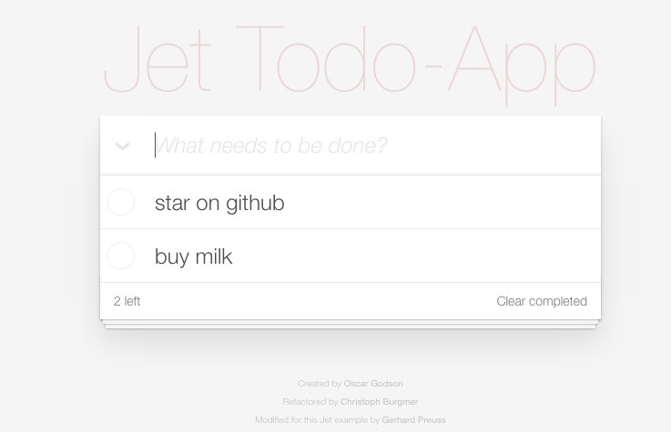

# About

[](https://gitter.im/lipp/node-jet?utm_source=badge&utm_medium=badge&utm_campaign=pr-badge&utm_content=badge)
[](http://badge.fury.io/js/node-jet) [](https://travis-ci.org/lipp/node-jet) [](https://codeclimate.com/github/lipp/node-jet) [](https://coveralls.io/r/lipp/node-jet?branch=master)
[](https://david-dm.org/lipp/node-jet.svg)

This is [Jet](http://jetbus.io/) for Javasript. Jet is the hybrid of an **In-Memory Database** and a **Realtime Push-Framework**. Node and Browsers are supported (using Browserify).


# Synopsis

## Start a Daemon:

```sh
$ jetd.js
```

## Provide Content:

```javascript
var jet = require('node-jet');

// connect to daemon
var peer = new jet.Peer({
  url: 'ws://localhost:11123' 
});

// provide methods/factories/services/actions/etc
var greet = new jet.Method('greet');
greet.on('call', function(who) {
  console.log('Hello', who);
});

peer.add(greet);

// provide documents/realtime-status/configuration/etc
var jim = new jet.State('persons/#123', getPerson('#123'));
jim.on('set', function(changedPerson) {
  setPerson('#123', changedPerson);
  // changes are propageted automatically
});

peer.add(jim);

// provide read-only stuff
var nowState = new jet.State('time/now', new Date().getTime());

peer.add(nowState);

// change async
setInterval(function() {
  nowState.value(new Date().getTime());
}, 100);
```

## Consume Content:

```javascript
// fetch/query content
var youngestPersons = new jet.Fetcher()
  .path('startsWith', 'persons/')
  .sortByKey('age', 'number')
  .ascending()
  .range(1, 20)
  .on('data', function(persons) {
    console.log(persons);
  });

peer.fetch(youngestPersons);

// call methods
peer.call('greet', ['Steve']).then(function(response) {
  console.log(response);
});

// set states
peer.set('person/#123', {name: 'Jose', age: 33});
```

## Tutorial

Read the [Todo-App Tutorial](https://github.com/lipp/node-jet/tree/master/examples/todo/README.md) for building this simple collaborative realtime app:

[](http://jetbus.io:8080)

# Install

## NPM
  
    $ npm install node-jet

## Bower

    $ bower install jet

## script tag
  
```html
<script src="https://rawgit.com/lipp/node-jet/master/build/jet.js"></script>
```

# Stand-Alone Daemon

The package provides a stand-alone Jet Daemon which listens on ports
11122 (trivial protocol) and 11123 (WebSockets) per default.

Start it like this (globally):

     $ jetd.js
     
Or - if installed locally:

     $ node_modules/.bin/jetd.js
     

# Integrated Daemon

If you want the Jet Daemon to listen for WebSockets on the same port as your existing
(node.js) HTTP server, use the [daemon.listen({server:httpServer})](https://github.com/lipp/node-jet/blob/master/doc/daemon.md#daemonlistentcpport1234wsport4321)
method like this:

```javascript
var httpServer = http.createServer(function(req, res) {
  // serve your stuff
});
httpServer.listen(80);

var daemon = new jet.Daemon();
daemon.listen({
  server: httpServer
});
```

# Radar

Open [Radar on jetbus.io](http://jetbus.io/radar.html), which allows you to see/observe Your Jet States and Methods. Your local Jet Daemon's default WebSocket address is `ws://localhost:11123`.


# Doc

 - [Peer](./doc/peer.markdown)
 - [Daemon](./doc/daemon.markdown)

For further info and documentation refer to the [Jet Homepage](http://jetbus.io).

# Todo-App

There is also the canonical ToDo-App available:

   - [Client + Server Tutorial](./examples/todo/README.md)
   - [Client code](https://github.com/lipp/todomvc/blob/add-jet-angular/examples/jet-angular/js/controllers/todoCtrl.js)
   - [Client code (using angular-jet)](https://github.com/lipp/angular-jet/blob/master/tests/protractor/todo/todo.js)
